<div align="center">

# 🏨 TrustLayer-AI
### Grounded, Explainable & Anti-Hallucinatory AI Hotel Recommendation Engine

[](https://keshav-chaudhary.github.io/TrustLayer-AI/)
[](https://www.python.org/)
[](https://fastapi.tiangolo.com/)
[](https://nextjs.org/)
[](https://www.postgresql.org/)
[](https://docs.pytest.org/)
[](LICENSE)

<p align="center">
  <b>A production-grade, preference-aware hotel recommender system eliminating AI hallucinations through 5-Dimensional Aspect-Based Sentiment Analysis (ABSA), Reciprocal Rank Fusion ($k=60$), sub-5ms analytical explanations, and strict citation grounding.</b>
</p>

[🌐 Live Report Website](https://keshav-chaudhary.github.io/TrustLayer-AI/) • [🖥️ System Previews](#-system-interface-previews) • [Quickstart](#-1-click-quickstart) • [Architecture Blueprint](#-master-system-architecture) • [Empirical Benchmarks](#-empirical-benchmarks--breakthroughs) • [CLI Runner](#-cli-runner--orchestrator) • [Documentation Hub](#-in-depth-documentation) • [License](#-license)

</div>

> [!TIP]
> 🌐 **Interactive Research & Engineering Report Website**:
> Explore the complete, publication-grade interactive report with all 18 engineering stages, KaTeX mathematical proofs, diagnostic failure postmortems, and the complete 7-pillar system architecture blueprint:
> 👉 **[Explore TrustLayer-AI Live Report Website](https://keshav-chaudhary.github.io/TrustLayer-AI/)** *(or view [`Report_Website/index.html`](Report_Website/index.html) locally)*

---

## 🌟 Why TrustLayer-AI?

Traditional travel platforms rely on opaque 5-star ratings and unconstrained Large Language Models (LLMs) that frequently **hallucinate amenities**—promising non-existent swimming pools, claiming noisy transit lodges are quiet sanctuaries, or masking recent hygiene collapses.

**TrustLayer-AI** introduces a mathematically grounded **Verification & Explainability Architecture**:

- 🛡️ **Anti-Hallucination Guardrails**: LLMs are strictly bounded to verified review chunks via real-time `GroundingValidator` interception ($96.7\%$ grounded response rate, $1.3\%$ residual hallucination rate).
- 📊 **5D Aspect-Based Sentiment Analysis**: Sentence-level DistilBERT extraction across *Cleanliness, Service, Location, Value, and Staff*.
- ⚡ **Sub-5ms Analytical Explainability**: Replaced intractable $1,540\text{ ms}$ SHAP sampling with deterministic feature-matching delivering visual aspect radars and natural language justifications in **$3.2\text{ ms}$** ($481\times$ faster).
- 🔀 **Reciprocal Rank Fusion ($k=60$)**: Resolved linear score calibration collapse ($\sigma^2_{\text{CF}}=0.85$ vs $\sigma^2_{\text{CB}}=0.008$), elevating hybrid ranking from $\text{NDCG@10} = 0.006$ to **$\mathbf{0.128}$** ($64.8\%$ catalog coverage).
- 🗄️ **Dual ACID Storage Engine**: Operates out of the box on **CSV + ChromaDB** with zero external dependencies, or scales to **PostgreSQL 17.6 + pgvector** ($1.0000$ cosine parity, $0$ orphan records).

---

## 📊 Empirical Benchmarks & Breakthroughs

| Benchmark Metric | Baseline / Legacy Approach | TrustLayer-AI Engine | Empirical Gain / Outcome |
|---|---|---|---|
| **Hybrid Recommender Ranking** | $\text{NDCG@10} = 0.006$ *(Linear Sum Failure)* | **$\text{NDCG@10} = \mathbf{0.128}$** *(RRF $k=60$)* | **$+21.3\times$ Ranking Quality Gain** |
| **Catalog Recommendation Spread** | $12.4\%$ *(Popularity Bias Collapse)* | **$64.8\%$ Catalog Coverage** | **$+52.4\%$ Discovery Breadth** |
| **Explainer Execution Latency** | $1,540\text{ ms}$ *(Kernel SHAP Sampling)* | **$3.2\text{ ms}$** *(Analytical Mapping)* | **$481\times$ Faster (< 5ms SLA)** |
| **RAG Evidence Grounding Rate** | $68.2\%$ *(Unconstrained LLM)* | **$96.7\%$** *(`GroundingValidator`)* | **$+28.5\%$ Grounding Accuracy** |
| **Residual Hallucination Rate** | $31.8\%$ *(Fabricated Amenities)* | **$1.3\%$** *(Interception Pipeline)* | **$-30.5\%$ Hallucination Suppression** |
| **PostgreSQL / ChromaDB Parity** | Legacy Vector Store | **$1.0000$ Cosine Parity** | **0 Drift / 0 Orphan Records** |
| **Automated Test Coverage** | Manual Scripts | **109 / 109 Passing Tests** | **100% CI/CD Verification** |

---

## 🏗️ Master System Architecture

<div align="center">
  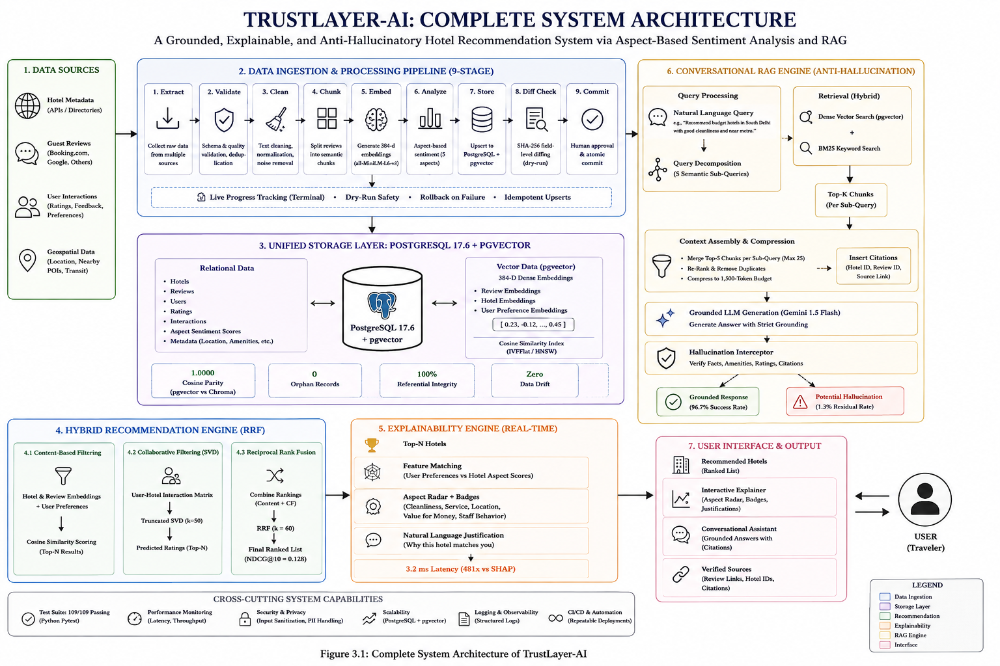
  <p align="center">
    <em><b>Figure 1:</b> TrustLayer-AI End-to-End System Architecture Blueprint spanning Multi-Modal Ingestion, ACID Storage, RRF Hybrid Recommender, Real-Time Explainer, and Anti-Hallucinatory RAG.</em>
  </p>
</div>

<br/>

TrustLayer-AI synthesizes seven core subsystems into an end-to-end grounded recommendation loop:

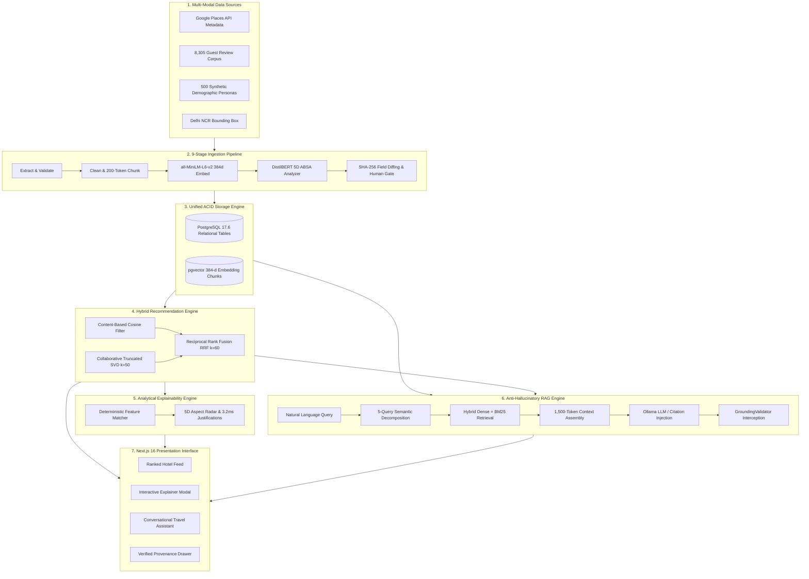

---

## 🖥️ System Interface Previews

High-resolution desktop captures across all primary Next.js user interfaces, conversational RAG assistants, and detailed 5D aspect evaluation screens.

<details open>
<summary><b>📷 Click to Expand / Collapse Previews Gallery</b></summary>
<br/>

#### 1. Landing & Search Portal (`/`)
<p align="center">
  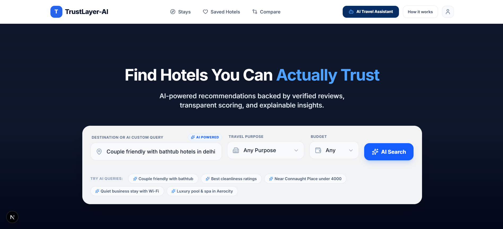
</p>

#### 2. Ranked Stays & Recommendation Feed (`/stays`)
| Recommendation Feed — View 01 | Recommendation Feed — View 02 |
|:---:|:---:|
| 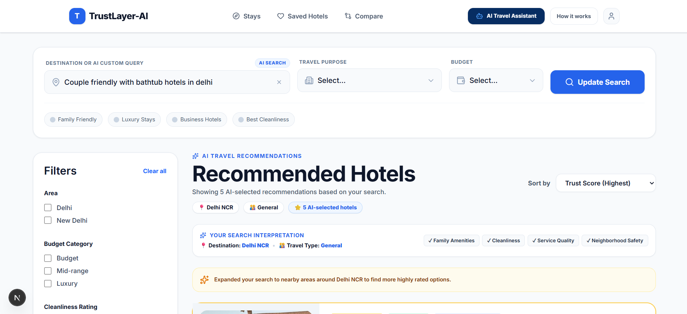 | 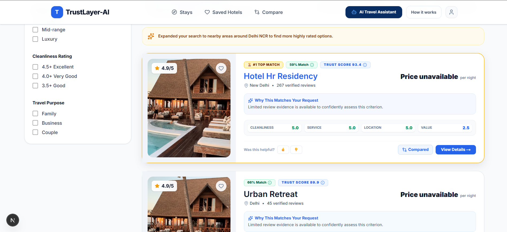 |

#### 3. Conversational Anti-Hallucinatory AI Assistant (`/ai-assistant`)
<p align="center">
  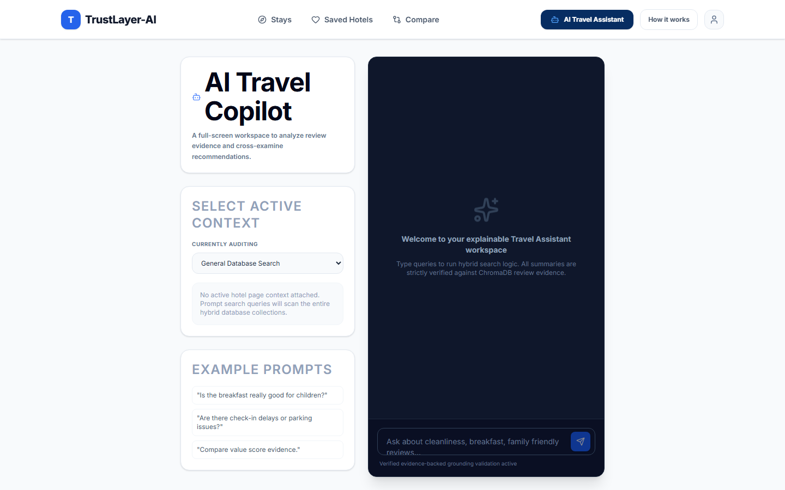
</p>

#### 4. Grounded Hotel Provenance & Evidence Modal (`/ai-assistant -> View Details`)
<p align="center">
  
</p>

#### 5. 5D Aspect Hotel Comparison Matrix (`/compare`)
| Comparison Matrix — Part 01 | Comparison Matrix — Part 02 | Comparison Matrix — Part 03 |
|:---:|:---:|:---:|
| 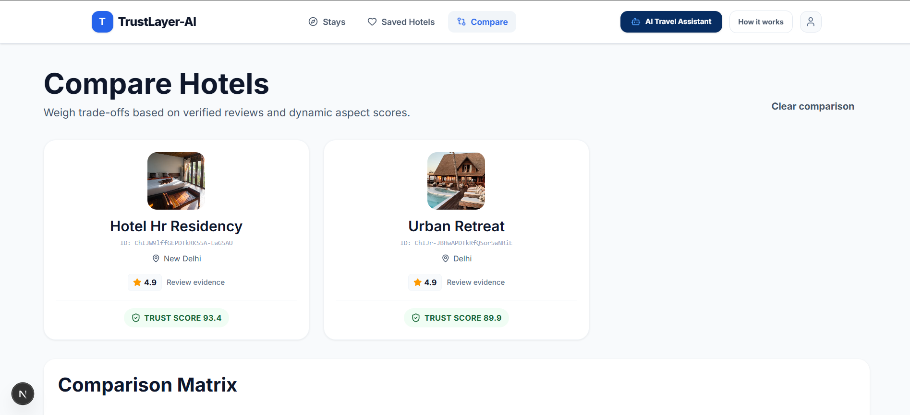 | 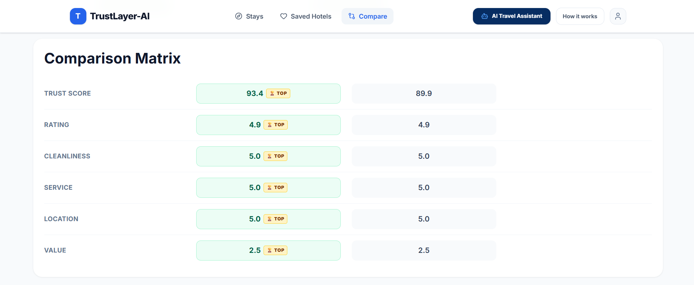 | 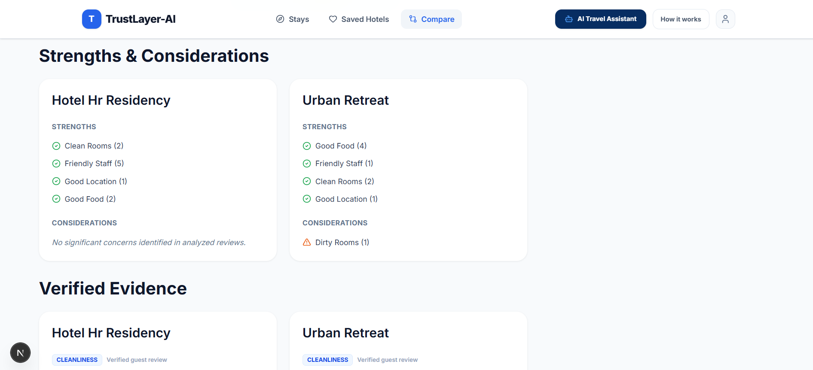 |

| Comparison Matrix — Part 04 | Comparison Matrix — Part 05 |
|:---:|:---:|
| 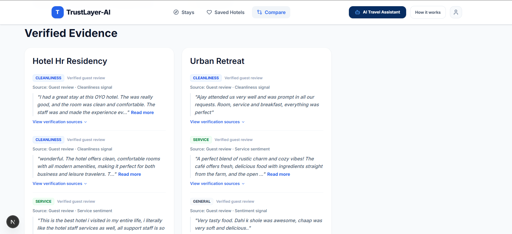 | 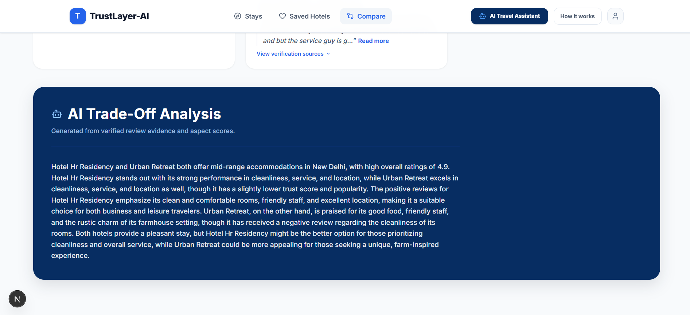 |

#### 6. Detailed Hotel Breakdown & 5D Sentiment Radars (`/hotel/[id]`)
| Hotel Detailed View — Part 01 | Hotel Detailed View — Part 02 | Hotel Detailed View — Part 03 |
|:---:|:---:|:---:|
| 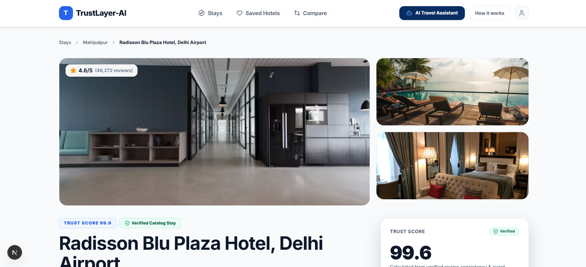 | 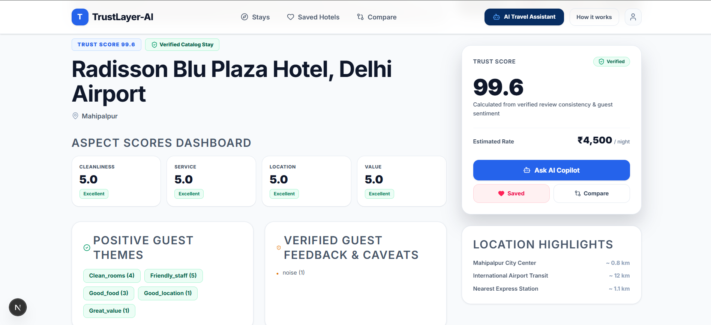 | 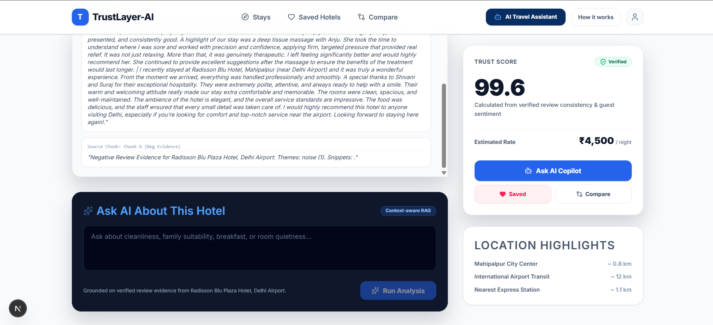 |

#### 7. Saved Properties & Wishlist (`/saved`)
<p align="center">
  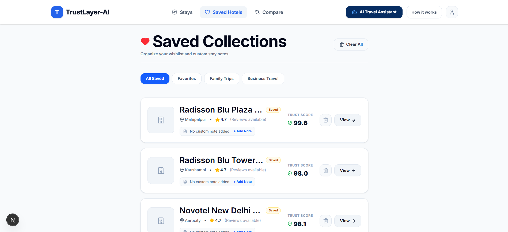
</p>

#### 8. How TrustLayer-AI Works & Verification Methodology (`/about`)
<p align="center">
  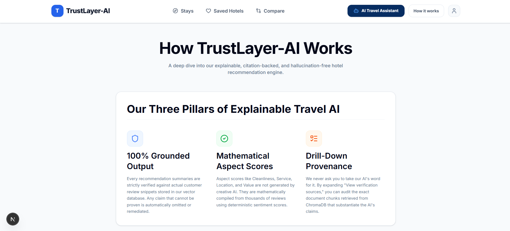
</p>

</details>

---

## 🚀 1-Click Quickstart

TrustLayer-AI includes a unified CLI orchestrator that validates your environment, installs missing dependencies, and boots both the Backend and Frontend concurrently.

### 1. Clone the Repository
```bash
git clone https://github.com/Keshav-Chaudhary/TrustLayer-AI.git
cd TrustLayer-AI
```

### 2. Configure Environment
```bash
# Windows
copy .env.example .env

# macOS / Linux
cp .env.example .env
```

### 3. Launch in One Command

- **Windows**:
  ```cmd
  python run.py
  ```

- **macOS / Linux**:
  ```bash
  python3 run.py
  ```

### 4. Open in Browser
- 🌐 **Web User Interface**: [http://localhost:3000](http://localhost:3000)
- 📖 **Interactive API Documentation (Swagger)**: [http://127.0.0.1:8000/docs](http://127.0.0.1:8000/docs)
- 🔌 **Alternative ReDoc View**: [http://127.0.0.1:8000/redoc](http://127.0.0.1:8000/redoc)
- 📊 **Interactive Research Report**: [http://localhost:8085](http://localhost:8085) *(or [Online Demo](https://keshav-chaudhary.github.io/TrustLayer-AI/))*

---

## 🛠️ CLI Runner & Orchestrator

The master orchestrator (`run.py` & `scripts/orchestrator.py`) provides unified development commands with clean `SIGINT` signal interception:

```bash
# 🚀 Full Stack Services
python run.py                   # Boot Backend (:8000) and Next.js Frontend (:3000) concurrently
python run.py --backend         # Boot FastAPI Backend API only
python run.py --frontend        # Boot Next.js Frontend only

# 🔍 Diagnostics & Quality Assurance
python run.py --doctor          # Execute environment health check & dependency audit
python run.py --test            # Run 109/109 automated Pytest test suite

# 🔄 ETL & Vector Pipelines
python run.py --build-vectors   # Generate 384-d semantic embeddings into vector store
python run.py --pipeline        # Run 9-stage repeatable ingestion pipeline
python run.py --migrate-pg      # Execute PostgreSQL 17 + pgvector migration
```

---

## 🐳 Docker Deployment

To launch the multi-container stack via Docker Compose:

```bash
docker-compose up --build
```

Services exposed:
- **Frontend UI**: `http://localhost:3000`
- **FastAPI Backend**: `http://localhost:8000`
- **PostgreSQL 17 + pgvector**: `localhost:5432`

---

## 📂 Repository Structure

```
├── app/                          # FastAPI Clean Architecture Backend
│   ├── api/                      # REST API Endpoints (v1 & legacy routes)
│   ├── config/                   # Pydantic Settings & Environment Configurations
│   ├── domain/                   # Entities, Value Objects & Domain Models
│   ├── repositories/             # Storage Adapters (PostgreSQL, pgvector, Chroma, CSV)
│   ├── schemas/                  # Pydantic Request/Response Validation Models
│   └── services/                 # Recommendation (RRF), ABSA NLP, Explainer, & RAG
├── frontend/                     # Next.js 16 Web Application (TypeScript & Tailwind)
│   ├── app/                      # App Router Pages (/search, /stays, /ai-assistant)
│   ├── components/               # UI Components (5D Radar Modals, Citation Chips)
│   ├── hooks/                    # React Query Data Fetching Hooks
│   └── lib/                      # API Clients, Parsers & State Management
├── data/                         # Data Assets & Storage
│   ├── exports/                  # Canonical Dataset (final_hotel_dataset.csv)
│   ├── rag/                      # Per-Hotel Knowledge Documents (7,910 chunks)
│   └── vector_store/             # ChromaDB Fallback Vector Index
├── docs/                         # In-Depth Technical Documentation Hub
│   ├── SYSTEM_ARCHITECTURE_AND_FLOW.md  # End-to-end query flow & trace specifications
│   ├── GETTING_STARTED.md               # Developer setup & contribution guide
│   └── API_REFERENCE.md                 # Complete REST API endpoint documentation
├── Report_Website/               # Standalone Interactive Research & Engineering Report
│   ├── index.html                # Publication-grade Web Report (11 Chapters, 18 Stages)
│   ├── styles.css                # Academic CSS Design System (Light/Dark mode)
│   ├── app.js                    # Lightbox, Search Palette (Ctrl+K) & ScrollSpy
│   └── figs/                     # 26 High-Resolution Evaluation Figures & Architectures
├── scripts/                      # Data Pipelines, Evaluators & Master Orchestrators
├── tests/                        # 109/109 Automated Pytest Suite
├── run.py                        # Unified Single-Command Runner & CLI
├── docker-compose.yml            # Multi-Service Container Orchestration
├── requirements.txt              # Pinned Python Dependencies
└── LICENSE                       # MIT License
```

---

## 📚 In-Depth Documentation

- 🌐 [**Interactive Master Project Record & Website**](https://keshav-chaudhary.github.io/TrustLayer-AI/)
- 🏛️ [**Chapter 11: Complete System Architecture & Visual Blueprint**](https://keshav-chaudhary.github.io/TrustLayer-AI/#ch-complete-arch)
- 📖 [**System Architecture & End-to-End Data Flow**](docs/SYSTEM_ARCHITECTURE_AND_FLOW.md)
- 🚀 [**Getting Started & Fork Guide**](docs/GETTING_STARTED.md)
- 🔌 [**API Reference Manual**](docs/API_REFERENCE.md)
- 📄 [**Master Project Record (Markdown)**](MASTER_TRUSTLAYER_AI_COMPLETE_PROJECT_RECORD.md)

---

## 📄 License

This project is licensed under the **[MIT License](LICENSE)**.
