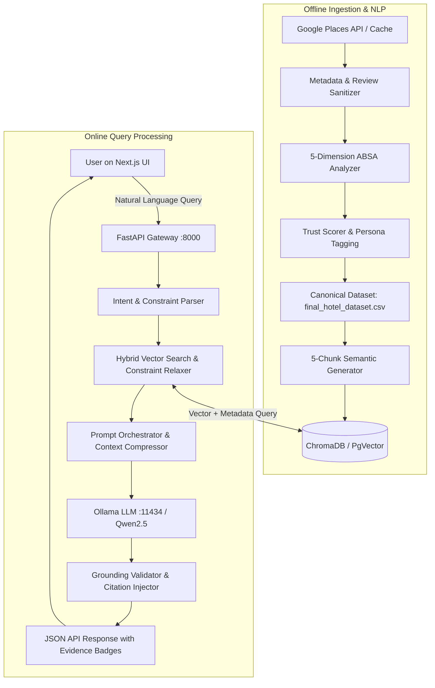

<div align="center">

# 🏨 TrustLayer-AI
### Grounded, Explainable & Anti-Hallucinatory AI Hotel Recommendation Engine

[](https://www.python.org/)
[](https://fastapi.tiangolo.com/)
[](https://nextjs.org/)
[](https://www.trychroma.com/)
[](https://ollama.com/)
[](https://docs.pytest.org/)
[](LICENSE)

<p align="center">
  <b>Eliminating hallucinations in travel AI through strict evidence grounding, 5D aspect-based sentiment analysis, and explainable trust scores.</b>
</p>

[Quickstart](#-1-click-quickstart) • [System Architecture](#-system-architecture) • [Key Features](#-key-features) • [CLI Runner](#-cli-runner-options) • [Documentation Hub](#-in-depth-documentation) • [License](#-license)

</div>

---

## 🌟 Why TrustLayer-AI?

Traditional travel platforms rely on opaque star ratings and LLMs that frequently **hallucinate amenities**—promising non-existent pools, claiming noisy budget lodges are quiet sanctuaries, or ignoring recent hygiene collapses.

**TrustLayer-AI** introduces a **Strict Grounding & Verification Framework**:
- 🛡️ **Anti-Hallucination Guardrails**: LLMs are mathematically constrained to verified review chunks. Every recommendation cites specific, non-hallucinated review evidence.
- 📊 **Explainable Trust Score (0–100)**: Evaluates consistency across 5 distinct operational dimensions (*Cleanliness, Service, Location, Value, and Staff Behavior*).
- ⚡ **Dual-Engine Architecture**: Runs completely out of the box on **CSV + ChromaDB** with **zero external database dependencies**, or scales to **PostgreSQL 16 + pgvector**.
- 🔄 **Smart Constraint Relaxation**: If strict search filters return zero matches, the system gracefully relaxes constraints (*Travel Persona → Budget Range → Adjacent Areas*) to always surface relevant stays.

---

## 🚀 1-Click Quickstart

TrustLayer-AI includes a unified CLI orchestrator that validates your environment, installs missing dependencies, and boots both the Backend and Frontend concurrently.

### 1. Clone the Repository
```bash
git clone https://github.com/your-username/TrustLayer-AI.git
cd TrustLayer-AI
```

### 2. Configure Environment
```bash
# Windows
copy .env.example .env

# macOS / Linux
cp .env.example .env
```

### 3. Launch Everything in One Command

- **Windows (Double-click or run)**:
  ```cmd
  python run.py
  ```

- **macOS / Linux**:
  ```bash
  python3 run.py
  ```

### 4. Open in Browser
- 🌐 **Web User Interface**: [http://localhost:3000](http://localhost:3000)
- 📖 **Interactive API Documentation**: [http://127.0.0.1:8000/docs](http://127.0.0.1:8000/docs)
- 🔌 **Alternative ReDoc API View**: [http://127.0.0.1:8000/redoc](http://127.0.0.1:8000/redoc)

---

## 🏗️ System Architecture



---

## ✨ Key Features

### 1. 5-Dimensional Aspect-Based Sentiment Analysis (ABSA)
Every hotel review is analyzed across 5 core criteria:
- 🧼 **Cleanliness**: Hygiene of rooms, linens, bathrooms, and pest control.
- 🛎️ **Service**: Check-in speed, room service responsiveness, and maintenance.
- 📍 **Location**: Proximity to metro transit, airports, noise levels, and neighborhood safety.
- 💰 **Value for Money**: Price-to-quality ratio and transparent pricing.
- 🤝 **Staff Behavior**: Hospitality, courtesy, and problem resolution.

### 2. 5-Chunk Semantic Decomposition
Each hotel is indexed into 5 distinct semantic vectors (`sentence-transformers/all-MiniLM-L6-v2`, 384 dimensions):
- **Chunk A (Profile)**: Hotel name, locality, price tier, and star rating.
- **Chunk B (Aspects)**: Quantitative sentiment scores across all 5 dimensions.
- **Chunk C (Positive Evidence)**: Positive theme tags and verbatim review quotes.
- **Chunk D (Negative Evidence)**: Critical feedback themes and verbatim review quotes.
- **Chunk E (Recommendation Signals)**: Trust score, popularity index, and sentiment rating.

### 3. Concrete User Query Flow
When a user asks:
> *"Find me a quiet boutique hotel near Connaught Place under 4000 INR with great cleanliness and good wifi for work"*

1. **Parser**: Extracts `{area: "Connaught Place", max_price: 4000, persona: "business", aspects: ["cleanliness", "wifi"]}`.
2. **Hybrid Search**: Retrieves candidate chunks from ChromaDB.
3. **Grounding Validator**: Validates that cited wifi speeds and quiet rooms are backed by verbatim review quotes in Chunk C.
4. **Response**: Delivers structured JSON with **Verified Evidence Badges** and honest cautions.

---

## 🛠️ CLI Runner Options

The `run.py` script provides commands for all development workflows:

```bash
python run.py                 # Launch both Backend (:8000) and Frontend (:3000)
python run.py --backend       # Launch FastAPI Backend only
python run.py --frontend      # Launch Next.js Frontend only
python run.py --doctor        # Run environment diagnostics & dependency health check
python run.py --test          # Run automated Pytest test suite
python run.py --build-vectors # Rebuild ChromaDB embeddings from data/rag/
python run.py --pipeline      # Run master ETL ingestion pipeline
```

---

## 🐳 Docker Deployment

To run the entire system with Docker Compose:

```bash
docker-compose up --build
```
Access the application at `http://localhost:3000` and API at `http://localhost:8000`.

---

## 📂 Repository Structure

```
├── app/                          # FastAPI Backend Architecture
│   ├── api/                      # REST API endpoints (v1 & compatibility)
│   ├── config/                   # Configuration & Pydantic Settings
│   ├── domain/                   # Domain entities and models
│   ├── repositories/             # Storage adapters (CSV, Chroma, Postgres, PgVector)
│   ├── schemas/                  # Pydantic validation schemas
│   └── services/                 # Recommendation, grounding, NLP, and LLM services
├── frontend/                     # Modern Next.js 16 Web Application
│   ├── app/                      # App router pages (/search, /stays, /ai-assistant)
│   ├── components/               # React UI components (Radar charts, trust badges)
│   ├── hooks/                    # React Query data fetching hooks
│   └── lib/                      # API client, intent parsers, state management
├── data/                         # Data Assets
│   ├── exports/                  # Canonical dataset: final_hotel_dataset.csv
│   ├── rag/                      # Per-hotel JSON knowledge documents
│   └── vector_store/             # ChromaDB vector index (chroma.sqlite3)
├── docs/                         # In-Depth Documentation Hub
│   ├── SYSTEM_ARCHITECTURE_AND_FLOW.md  # Exhaustive data flow & query trace
│   ├── GETTING_STARTED.md               # Step-by-step setup guide
│   └── API_REFERENCE.md                 # Complete API endpoint specifications
├── scripts/                      # Data pipeline, NLP analyzers, and RAG builders
├── tests/                        # Automated Pytest test suite
├── run.py                        # Unified single-command runner & CLI
├── docker-compose.yml            # Multi-service container orchestration
├── requirements.txt              # Pinned Python dependencies
└── LICENSE                       # MIT License
```

---

## 📚 In-Depth Documentation

For complete technical specifications, see the documents in the [`docs/`](docs/) directory:
- 📖 [**System Architecture & End-to-End Data Flow**](docs/SYSTEM_ARCHITECTURE_AND_FLOW.md)
- 🚀 [**Getting Started & Fork Guide**](docs/GETTING_STARTED.md)
- 🔌 [**API Reference Manual**](docs/API_REFERENCE.md)
- 📄 [**TrustLayer AI Development Journey (PDF)**](TRUSTLAYER_AI_DEVELOPMENT_JOURNEY.pdf)

---

## 🧪 Automated Testing

TrustLayer-AI includes automated test coverage for API endpoints, repository adapters, RAG grounding, and data integrity:

```bash
pytest
# or
python run.py --test
```

---

## 📄 License

This project is licensed under the [MIT License](LICENSE).
