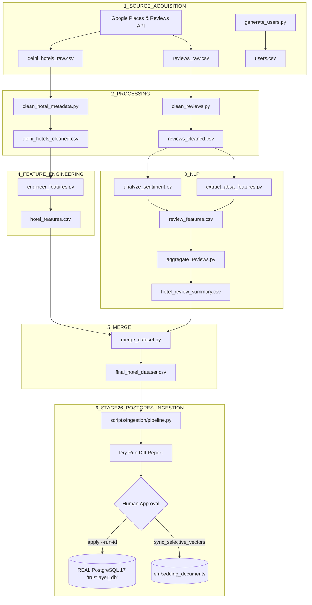

# STAGE 27 — DATA DEPENDENCY GRAPH

```mermaid
graph TD
    subgraph 1_SOURCE_ACQUISITION
        API[Google Places & Reviews API] --> RawHotels[delhi_hotels_raw.csv]
        API --> RawReviews[reviews_raw.csv]
        UsersGen[generate_users.py] --> UsersCSV[users.csv]
    end

    subgraph 2_PROCESSING
        RawHotels --> CleanHotels[clean_hotel_metadata.py] --> CleanHotelsCSV[delhi_hotels_cleaned.csv]
        RawReviews --> CleanReviews[clean_reviews.py] --> CleanReviewsCSV[reviews_cleaned.csv]
    end

    subgraph 3_NLP
        CleanReviewsCSV --> Sentiment[analyze_sentiment.py]
        CleanReviewsCSV --> ABSA[extract_absa_features.py]
        Sentiment & ABSA --> ReviewFeatures[review_features.csv]
        ReviewFeatures --> AggReviews[aggregate_reviews.py] --> HotelReviewSummary[hotel_review_summary.csv]
    end

    subgraph 4_FEATURE_ENGINEERING
        CleanHotelsCSV --> EngFeatures[engineer_features.py] --> HotelFeatures[hotel_features.csv]
    end

    subgraph 5_MERGE
        HotelFeatures & HotelReviewSummary --> MergeScript[merge_dataset.py] --> CanonicalCSV[final_hotel_dataset.csv]
    end

    subgraph 6_STAGE26_POSTGRES_INGESTION
        CanonicalCSV --> Pipeline[scripts/ingestion/pipeline.py]
        Pipeline --> DryRun[Dry Run Diff Report]
        DryRun --> Approval{Human Approval}
        Approval -->|apply --run-id| Postgres[(REAL PostgreSQL 17 'trustlayer_db')]
        Approval -->|sync_selective_vectors| PgVector[(embedding_documents)]
    end
```
