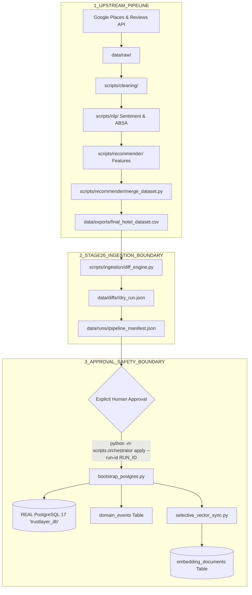

# STAGE 28 — ONE-COMMAND END-TO-END DATA PIPELINE ARCHITECTURE

## Core Execution Semantics
- `python -m scripts.orchestrator full` — Executes upstream stages 1 through 5, generates `final_hotel_dataset.csv`, computes Stage 26 diff against PostgreSQL, produces `pipeline_manifest.json`, and **STOPS AT DRY-RUN**. Zero database mutation occurs during `full`.
- `python -m scripts.orchestrator apply --run-id <RUN_ID>` — Applies the approved `RUN_ID` transactionally to PostgreSQL and updates affected vector embeddings selectively.
