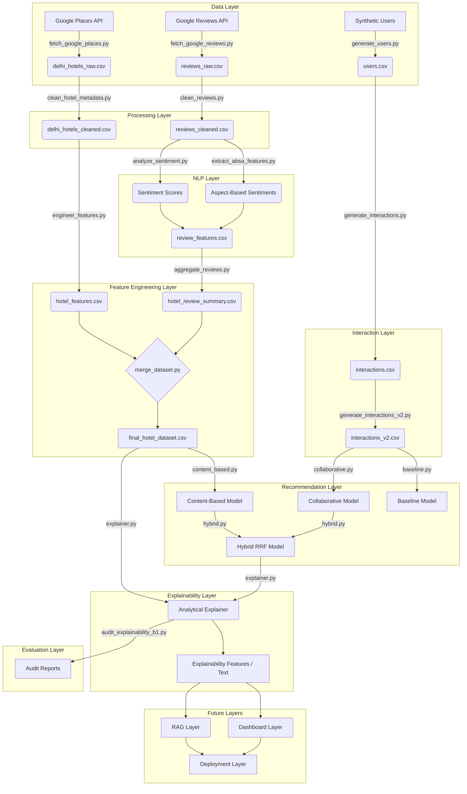

# Project Architecture

## System Architecture Diagram

## Layer Details

### 1. Data Layer
Responsible for data acquisition. Interfaces with external APIs (Google Places) and handles raw data storage. Also responsible for generating synthetic user profiles to simulate a live platform.

### 2. Processing Layer
Handles all data sanitization, missing value imputation, string standardization, and duplicate removal. Ensures downstream pipelines receive robust data.

### 3. NLP Layer
Extracts semantic meaning from raw text. Utilizes pre-trained models to derive overall sentiment polarity and aspect-specific sentiments (e.g., cleanliness, location, service).

### 4. Feature Engineering Layer
Derives composite metrics (like Trust Score) and scales continuous variables. Aggregates NLP outputs at the hotel level and merges all data streams into a single `final_hotel_dataset.csv`.

### 5. Recommendation Layer
The core algorithmic engine. Utilizes a hybrid approach relying on Reciprocal Rank Fusion (RRF) to blend Content-Based filtering (metadata/NLP features) with Collaborative Filtering (matrix factorization on synthetic interactions).

### 6. Explainability Layer
An analytical rule engine that decouples from the ML inference. It compares the user's latent preference vectors to the recommended hotel's top features, generating natural language explanations for the recommendation.

### 7. Evaluation Layer
A suite of validation scripts and notebooks that compute offline metrics (Precision, Recall, NDCG), evaluate fairness/bias, and programmatically audit the explainability logic for hallucinations.

### 8. Future RAG Layer (Pending)
Will implement Retrieval-Augmented Generation using a Vector Database (e.g., FAISS, Pinecone) to allow users to query the hotel database via conversational LLM interface.

### 9. Future Dashboard Layer (Pending)
Will implement a UI (e.g., Streamlit, Next.js) to visualize recommendations and explanations interactively.

### 10. Future Deployment Layer (Pending)
Will containerize the API (Docker/FastAPI) and deploy the system to cloud infrastructure.
